# SAST tools comparison

>Authors:
>- Arsen Galiev
>- Peter Zavadskii
>- Ilya-Linh Nguen
>- Kirill Nosov
>- Sarmat Lutfullin

## Introduction

This project constitutes a modest comparative analysis of seven Static Application Security Testing (SAST) tools, evaluated across three security benchmarks of varying scales. The objective is to aggregate and scrutinize the outputs of SAST scanners, assess their vulnerability detection efficacy using MITRE CWE metrics, and conduct pairwise comparisons within feasible dimensions.

The following static analysis tools were selected:
- PVS-Studio
- Semgrep
- OpenGrep
- CodeQL
- SonarQube
- Joern
- PMD

The rationale for selecting these analyzers stems from the study's focus on open-source instruments, with PVS-Studio incorporated experimentally for benchmarking purposes, as it is available gratis for open-source initiatives upon vendor request ([source](https://pvs-studio.com/en/order/open-source-license/)).

Scanning was performed on the subsequent open benchmarks, aligned with the programming languages comprehensively supported by each tool:

- NIST Juliet (C/C++, C#, Java)
- OWASP Benchmark (Python, Java)
- IAMeter by Positive Technologies (Go, PHP, Java)

These benchmarks were deliberately chosen due to their heterogeneity—not merely in target programming languages, but also in corpus size (file count and lines of code):

- NIST: An expansive test suite comprising tens of thousands of lines per language, albeit with portions tailored to legacy environments (e.g., NIST Juliet Java targets JDK 8).

- OWASP Benchmark: Of intermediate scale relative to the others, featuring contemporary tests aligned with OWASP risk ratings.

- IAMeter: Exhibits the minimal case volume, offset by expedited result validation attributable to its compact footprint.

Preliminary aggregate scanning results for each analyzer are depicted in the figure below:

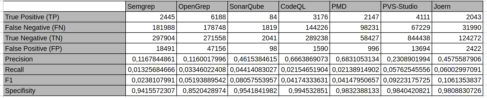

Here on wich test suite was each SAST tool tested:

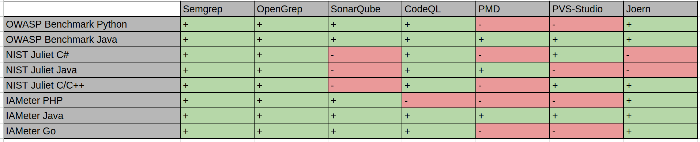

Characteristics of each analyzer with references:

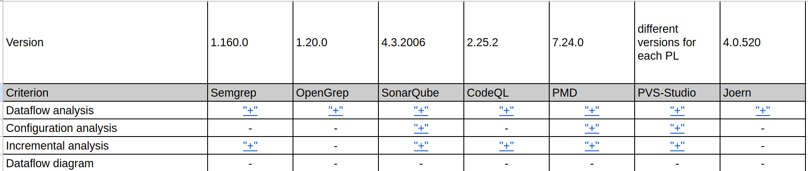

Source spreadsheet is on the link: [LINK](https://docs.google.com/spreadsheets/d/1immwEj_XTfbIRZCNeEyJnkL1dWe9kQvq9gs83L8VNTI/edit?gid=0#gid=0)

## IAMeter

> by Ilya-Linh Nguen (GitHub: [ilyalinhnguyen](https://github.com/ilyalinhnguyen)) 

#### Scope of Scanning

Three repositories from the Positive Technologies organization were selected:

- IAMeter_Go
- IAMeter_Java
- IAMeter_PHP

They are written in Go, Java, and PHP respectively.

##### IAMeter_Go

- Lines of code: **450**
- Number of files: **10**
- CWE coverage: 2 types: **CWE-79** (Cross-site Scripting / XSS, *Improper Neutralization of Input During Web Page Generation*) and **CWE-611** (XXE, *Improper Restriction of XML External Entity Reference*)

##### IAMeter_Java

- Lines of code: **334**
- Number of files: **10**
- CWE coverage: 2 types: **CWE-79** (Cross-site Scripting / XSS, *Improper Neutralization of Input During Web Page Generation*) and **CWE-611** (XXE, *Improper Restriction of XML External Entity Reference*)

##### IAMeter_PHP

- Lines of code: **256**
- Number of files: **10**
- CWE coverage: 2 types: **CWE-79** (Cross-site Scripting / XSS, *Improper Neutralization of Input During Web Page Generation*) and **CWE-611** (XXE, *Improper Restriction of XML External Entity Reference*)

#### Analyzer Usage

Each repository used its own analyzer scope. This is because some analyzers do not support every programming language used in the benchmark.

The table below shows which analyzer scanned each project, according to the rows in `total.csv` / CompSAST, and where a tool was not included in the set or was intended for only one language.

| Analyzer | IAMeter_Go | IAMeter_Java | IAMeter_PHP |
| ---------- | ---------- | ------------ | ----------- |
| **Semgrep** | yes | yes | yes |
| **OpenGrep** | yes | yes | yes |
| **CodeQL** | yes | yes | no |
| **SonarQube** | yes | yes | yes |
| **PMD** | no* | yes | no* |
| **PVS-Studio** | no | yes | no |
| **Joern** (joern-scan) | yes | yes | yes |

* For `Go` and `PHP`, **PMD** supports only `CPD`, the copy-paste detector.

All analyzers except **PVS-Studio** scanned each project as a whole. Due to the specifics of its operation, and to obtain more accurate results, **PVS-Studio** scanned the project file by file.

#### Analysis Process and Helper Scripts

##### Semgrep

This analyzer was run with the following command:

```bash
semgrep scan --config auto --sarif --output=results.sarif
```

##### OpenGrep

This analyzer was run with the following command:

```bash
opengrep scan --sarif-output=output.sarif
```

##### CodeQL

To scan with this analyzer, a database must first be created:

```bash
codeql database create <db-name> --language=<lang> --source-root <path-to-root>
```

Then the analysis is run:

```bash
codeql database analyze <db-name> \
  --format=sarifv2.1.0 \
  --output=<output-name>.sarif \
  codeql/java-queries:codeql-suites/java-security-and-quality.qls # Add the rule set for the specific programming language here
```

##### SonarQube

First, **SonarQube** had to be deployed locally. This was done with Docker:

```bash
docker run -d --name sonarqube -p 9000:9000 sonarqube:community
```

Then projects for the repositories were created in SonarQube. After that, sonar-scanner had to be downloaded and the analysis was run:

```bash
cd project

sonar-scanner \
  -Dsonar.projectKey=<project-key> \
  -Dsonar.sources=. \
  -Dsonar.host.url=http://localhost:9000 \
  -Dsonar.token=<sonar-token>
```

After that, issues were exported from the SonarQube server to `SARIF` using the `compsast-artifacts/sonar_issues_to_sarif.py` script. The script works as follows:
- It sends HTTPS requests to `/api/issues/search` with pagination, open issues, and `componentKeys=<projectKey>`.
- It builds `runs[0].results` with file paths and line ranges; `properties` contains the issue key, type, Sonar severity, and other available API fields.
- The token and URL are passed through flags or through `SONAR_TOKEN`, `SONAR_HOST_URL`, and `SONAR_PROJECT_KEY`.

Example:

```bash
export SONAR_TOKEN=<sonar-token>
python3 compsast-artifacts/sonar_issues_to_sarif.py \
  --host http://localhost:9000 \
  --project-key <project-key> \
  -o sonarqube.sarif
```

##### PMD

This analyzer was run with the following command:

```bash
pmd check --dir ./src --rulesets category/java/security.xml  --format sarif --report-file pmd-report.sarif
```

##### PVS-Studio

`pvs_iameter_java_per_file.sh` sequentially runs PVS-Studio Java on each file in `IAMeter_Java/src/main/java/iameter/*.java`, writes a separate JSON report for each file to `pvs-by-file/`, and then calls **`merge_pvs_json_reports.py`**, which merges these reports into a single `pvs_project_report_per_file.json`. After that, **plog-converter** from the PVS distribution converts the final JSON report to SARIF:

```bash
plog-converter -t sarif -o pvs-iameter.sarif pvs_project_report_per_file.json
```

##### Joern

Scanning was performed by the `compsast-artifacts/joern_iameter_all.sh` script. It runs `joern-scan` three times from the repository root: separately for *IAMeter_Go*, *IAMeter_Java*, and *IAMeter_PHP*; each run contains files from only one language. Before the Java run, `mvn -q compile` is executed. The output of each run is written next to the project as *`IAMeter_*/joern-scan.txt`*. Then *`joern_scan_txt_to_sarif.py`* is executed to build *`IAMeter_*/joern-scan.sarif`*. Language keys are set through the **`JOERN_LANG_*`** variables or default to `golang`, `java`, and `php`.

#### Scan Results

The table below summarizes which CWE categories the tools found after SARIF matching. The *"-"* marker means that the analyzer was not run for the language of that repository.

| Analyzer | IAMeter_Java | IAMeter_Go | IAMeter_PHP |
| ----------- | ----------- | --------- | --------- |
| **Semgrep** | CWE-79 and CWE-611 | CWE-79 | not found |
| **OpenGrep** | CWE-79 and CWE-611 | CWE-79 | not found |
| **CodeQL** | CWE-79 | not found | - |
| **SonarQube** | not found | - | not found |
| **PMD** | not found | - | - |
| **PVS-Studio** | not found | - | - |
| **Joern** | not found | not found | not found |

 
Total statistics:

IAMeter Golang ([source](https://docs.google.com/spreadsheets/d/1immwEj_XTfbIRZCNeEyJnkL1dWe9kQvq9gs83L8VNTI/edit?gid=1355400818#gid=1355400818)):

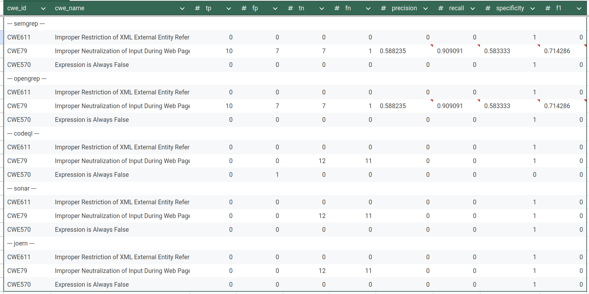

IAMeter Java ([source](https://docs.google.com/spreadsheets/d/1immwEj_XTfbIRZCNeEyJnkL1dWe9kQvq9gs83L8VNTI/edit?gid=1023034246#gid=1023034246)):

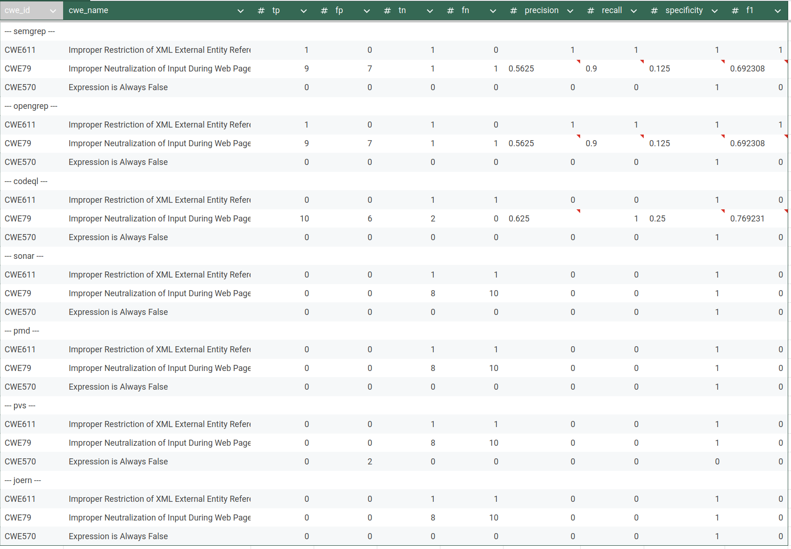

IAMeter PHP ([soure](https://docs.google.com/spreadsheets/d/1immwEj_XTfbIRZCNeEyJnkL1dWe9kQvq9gs83L8VNTI/edit?gid=1549158731#gid=1549158731)):

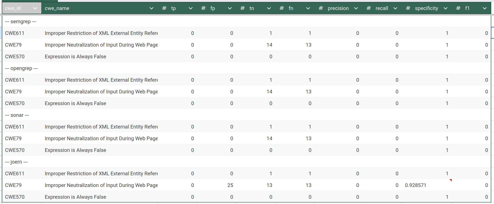


All artifacts on GitHub: [LINK](https://github.com/CompSAST/help-tools/tree/main/IAMeter)

## OWASP Benchmarks

> by Peter Zavadskii (Github: [Abraham14711](https://github.com/Abraham14711)) 

### 1. Scope of Scanning

The benchmark dataset consists of a curated set of vulnerable projects used for evaluating static analysis tools. Based on the archive structure:
* Root directory: Benchmark/
* Contains:
    * Analysis scripts (analysing_scripts/)
    * Tool reports (reports/)

### 2. Tools Used
#### Analyzers
The following static analysis tools were used:
* PMD (Java only)
* PVS-Studio (Java only)
* SonarQube
* Semgrep
* CodeQL
* OpenGrep
* Joern


### OWASP BenchmarkJava

The OWASP BenchmarkJava dataset is a mature and widely used benchmark for evaluating static application security testing (SAST) tools. In version 1.2, it contains approximately 2,740 test cases, each implemented as an individual Java servlet. Earlier versions contained significantly more test cases (over 20,000), but the current version focuses on a curated and balanced subset.

Each test case represents a single vulnerability instance (or a false positive case) associated with a specific CWE category. The dataset is structured as a full web application, with the main source code located in the `src/` directory. It also includes supporting scripts, tooling, and a ground truth file (`expectedresults-1.2.csv`) used for evaluation.

The project is primarily written in Java, with some HTML components used for web interaction. In practice, this results in thousands of Java classes and a codebase that reaches tens of thousands of lines of code.

The dataset covers a focused set of common web vulnerabilities. The main CWE categories include:
- CWE-78 (Command Injection)
- CWE-89 (SQL Injection)
- CWE-79 (Cross-Site Scripting, XSS)
- CWE-22 (Path Traversal)
- CWE-90 (LDAP Injection)
- CWE-643 (XPath Injection)
- CWE-327 (Use of Broken or Risky Cryptographic Algorithm)
- CWE-328 (Weak Hashing)
- CWE-330 (Insufficiently Random Values)
- CWE-501 (Trust Boundary Violation)
- CWE-614 (Sensitive Cookie Without Secure Flag)

Overall, BenchmarkJava provides strong coverage of classical web application vulnerabilities and is considered a standard dataset for SAST benchmarking.

---

### OWASP BenchmarkPython

The OWASP BenchmarkPython dataset is a newer and less mature benchmark compared to its Java counterpart. It contains approximately 1,230 test cases and is currently considered a preliminary version (v0.1).

Like the Java version, each test case represents a single vulnerability or a negative (non-vulnerable) example. The dataset is also structured as a web application, but it is significantly smaller in size—roughly two to three times smaller than BenchmarkJava in terms of both test cases and overall code volume.

The project is written primarily in Python and follows a similar philosophy: synthetic, well-isolated test cases designed for precise evaluation of static analyzers.

BenchmarkPython covers a broader and slightly more modern range of CWE categories compared to the Java dataset. These include:
- CWE-78 (Command Injection)
- CWE-89 (SQL Injection)
- CWE-79 (Cross-Site Scripting, XSS)
- CWE-22 (Path Traversal)
- CWE-90 (LDAP Injection)
- CWE-94 (Code Injection)
- CWE-502 (Deserialization of Untrusted Data)
- CWE-601 (Open Redirect)
- CWE-611 (XML External Entity, XXE)
- CWE-643 (XPath Injection)
- CWE-328 (Weak Hashing)
- CWE-330 (Weak Randomness)
- CWE-501 (Trust Boundary Violation)
- CWE-614 (Secure Cookie Issues)

Notably, this dataset includes vulnerability types that are less represented in the Java benchmark, such as deserialization issues and XXE.

---

### Comparison and Key Takeaways

BenchmarkJava is larger, more mature, and more widely adopted. It provides a stable and well-understood baseline for evaluating static analysis tools, especially for traditional web vulnerabilities.

BenchmarkPython, while smaller and less mature, introduces a broader set of CWE categories and reflects more modern vulnerability patterns. However, its limited size and early-stage development make it less comprehensive for large-scale evaluation.

Both datasets share the same core design principles:
- Synthetic, controlled test cases
- One vulnerability per test
- Explicit ground truth labeling

These characteristics make them particularly suitable for quantitative evaluation of static analysis tools using metrics such as precision, recall, and F1-score.

##### Report: 
* Total report files:
    * Python reports: 5
    * Java reports: 7
* Total analysis scripts: 7
* Dataset includes projects in:
    * Python
    * Java

### 3. Scanning Methodology

All the project were scanned by ```Whole-project analysis``` method. It is the only available aproach for owasp benchmarks since these projects are too huge to scan file-by-file manually.

Reproducibility Scripts ([source on GitHub](https://github.com/CompSAST/help-tools/tree/main/OWASP-Benchmarks))

The my analysis includes custom scripts:
- my_pmd_results.py
- my_pvs-studio_results.py
- my_sonar_results.py
- my_semgrep_results.py
- my_codeql_results.py
- my_opengrep_results.py
- my_joern_results.py

These scripts:
1. Parse raw tool outputs
2. Normalize findings
3. Map findings to CWE IDs
4. Compare results against ground truth
5. Compute evaluation metrics


### Results :
Java Benchmark ([source](https://docs.google.com/spreadsheets/d/1immwEj_XTfbIRZCNeEyJnkL1dWe9kQvq9gs83L8VNTI/edit?gid=1821318968#gid=1821318968)): 

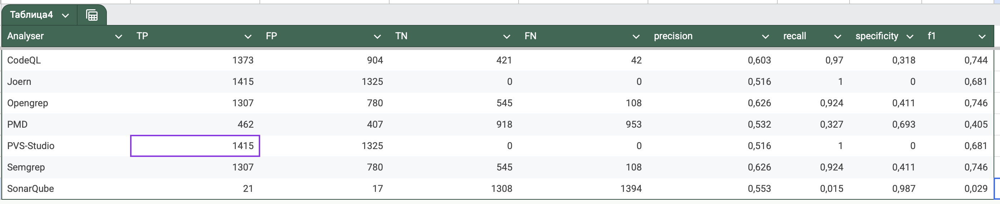

Python Benchmark ([source](https://docs.google.com/spreadsheets/d/1immwEj_XTfbIRZCNeEyJnkL1dWe9kQvq9gs83L8VNTI/edit?gid=777547730#gid=777547730)): 

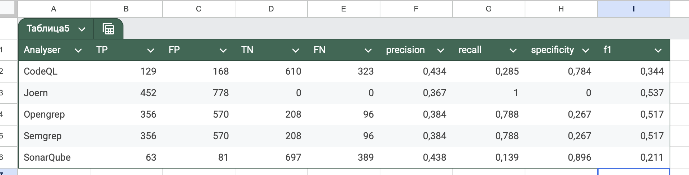


## NIST Juliet C#
> by Arsen Galiev (Github: [projacktor](https://github.com/projacktor))

Test suite source: https://samate.nist.gov/SARD/test-suites/110

### Scope of Scanning

Benchmark NIST Juliet C# has a following characteristics:
- Name: NIST Juliet C# v. 1.3 by 01.08.2020
- Files (src/testcases) number: 47267
- Code lines: 112339
- Programming language C#
- CWEs: 105 types

Types of CWEs:

| cwe_id | cwe_name |
| --- | --- |
| CWE-15 | External Control of System or Configuration Setting |
| CWE-23 | Relative Path Traversal |
| CWE-36 | Absolute Path Traversal |
| CWE-78 | OS Command Injection |
| CWE-80 | XSS |
| CWE-81 | XSS Error Message |
| CWE-83 | XSS Attribute |
| CWE-89 | SQL Injection |
| CWE-90 | LDAP Injection |
| CWE-94 | Improper Control of Generation of Code |
| CWE-113 | HTTP Response Splitting |
| CWE-114 | Process Control |
| CWE-117 | Improper Output Neutralization for Logs |
| CWE-129 | Improper Validation of Array Index |
| CWE-134 | Externally Controlled Format String |
| CWE-190 | Integer Overflow |
| CWE-191 | Integer Underflow |
| CWE-193 | Off by One Error |
| CWE-197 | Numeric Truncation Error |
| CWE-209 | Information Leak Error |
| CWE-226 | Sensitive Information Uncleared Before Release |
| CWE-248 | Uncaught Exception |
| CWE-252 | Unchecked Return Value |
| CWE-253 | Incorrect Check of Function Return Value |
| CWE-256 | Unprotected Storage of Credentials |
| CWE-259 | Hard Coded Password |
| CWE-261 | Weak Cryptography for Passwords |
| CWE-284 | Improper Access Control |
| CWE-313 | Cleartext Storage in a File or on Disk |
| CWE-314 | Cleartext Storage in the Registry |
| CWE-315 | Cleartext Storage in Cookie |
| CWE-319 | Cleartext Tx Sensitive Info |
| CWE-321 | Hard Coded Cryptographic Key |
| CWE-325 | Missing Required Cryptographic Step |
| CWE-327 | Use Broken Crypto |
| CWE-328 | Reversible One Way Hash |
| CWE-329 | Not Using Random IV with CBC Mode |
| CWE-336 | Same Seed in PRNG |
| CWE-338 | Weak PRNG |
| CWE-350 | Reliance on Reverse DNS Resolution for Security Action |
| CWE-366 | Race Condition within a Thread |
| CWE-369 | Divide by Zero |
| CWE-378 | Temporary File Creation With Insecure Perms |
| CWE-379 | Temporary File Creation in Insecure Dir |
| CWE-390 | Error Without Action |
| CWE-395 | Catch NullPointerException |
| CWE-396 | Catch Generic Exception |
| CWE-397 | Throw Generic Exception |
| CWE-398 | Code Quality |
| CWE-400 | Uncontrolled Resource Consumption |
| CWE-404 | Improper Resource Shutdown |
| CWE-426 | Untrusted Search Path |
| CWE-427 | Uncontrolled Search Path Element |
| CWE-440 | Expected Behavior Violation |
| CWE-459 | Incomplete Cleanup |
| CWE-470 | Unsafe Reflection |
| CWE-476 | NULL Pointer Dereference |
| CWE-477 | Obsolete Functions |
| CWE-478 | Missing Default Case in Switch |
| CWE-481 | Assigning Instead of Comparing |
| CWE-482 | Comparing Instead of Assigning |
| CWE-483 | Incorrect Block Delimitation |
| CWE-486 | Compare Classes by Name |
| CWE-506 | Embedded Malicious Code |
| CWE-510 | Trapdoor |
| CWE-511 | Logic Time Bomb |
| CWE-523 | Unprotected Cred Transport |
| CWE-526 | Info Exposure Environment Variables |
| CWE-532 | Inclusion of Sensitive Info in Log |
| CWE-535 | Info Exposure Shell Error |
| CWE-539 | Information Exposure Through Persistent Cookie |
| CWE-546 | Suspicious Comment |
| CWE-549 | Missing Password Masking |
| CWE-561 | Dead Code |
| CWE-563 | Assign to Variable Without Use |
| CWE-566 | Authorization Bypass Through SQL Primary |
| CWE-570 | Expression Always False |
| CWE-571 | Expression Always True |
| CWE-582 | Array Public Readonly Static |
| CWE-598 | Information Exposure QueryString |
| CWE-601 | Open Redirect |
| CWE-605 | Multiple Binds Same Port |
| CWE-606 | Unchecked Loop Condition |
| CWE-609 | Double Checked Locking |
| CWE-613 | Insufficient Session Expiration |
| CWE-614 | Sensitive Cookie Without Secure |
| CWE-615 | Info Exposure by Comment |
| CWE-617 | Reachable Assertion |
| CWE-643 | Xpath Injection |
| CWE-667 | Improper Locking |
| CWE-674 | Uncontrolled Recursion |
| CWE-675 | Duplicate Operations on Resource |
| CWE-681 | Incorrect Conversion Between Numeric Types |
| CWE-690 | NULL Deref From Return |
| CWE-698 | Execution After Redirect |
| CWE-759 | Unsalted One Way Hash |
| CWE-760 | Predictable Salt One Way Hash |
| CWE-764 | Multiple Locks |
| CWE-765 | Multiple Unlocks |
| CWE-772 | Missing Release of Resource |
| CWE-775 | Missing Release of File Descriptor or Handle |
| CWE-789 | Uncontrolled Mem Alloc |
| CWE-832 | Unlock Not Locked |
| CWE-833 | Deadlock |
| CWE-835 | Infinite Loop |

### Which tools were/not used

The benchmark was applied for the following list of SAST tools:

- Semgrep
- Opengrep
- CodeQL
- PVS-Studio

And by the reasons below was not run by SonarQube, PMD and Joern:

- SonarQube was applied, but the test suite size was too large for the tool, therefore several machines on AMD Ryzen 5500U and AMD Ryzen 5600H (16GiB RAM both) could not proceed the scan results and shutdown in process.

- PMD does not support proper C# scanning, only copy-paste-detector (CPD).

- Joern does not support C# language at all.

### Terms:

- `Safe-sink`. In test suite we may have a following code constructions:
```csharp
/* FIX: Use a hardcoded string */
data = "foo";
/* POTENTIAL FLAW: no validation of concatenated value */
if (File.Exists(root + data))
The string POTENTIAL FLAW looks like a dangerous sink, but in this Good* path, the data is already safe: for example, data is specified as a constant, has passed validation, or came from a safe source.
```
Therefore, for the script:
    - POTENTIAL FLAW in a `Bad*` method -> vulnerable point;
    - POTENTIAL FLAW in a `Good*` method -> safe point, i.e., safe-sink.
    If the analyzer complains about such a POTENTIAL FLAW inside a `Good*` method, it is considered FP, because it "fell for" a seemingly similar but safe path.

- `TP, FP, TN, FN` - True Positive, False Positive, True Negative, False Negative respectively

- `Bad path` - Juliet execution path that intentionally contains a vulnerable data flow

- `Good path` - Juliet execution path where the same sink may exist, but the data flow is safe.
- `Bad* method` - method treated as vulnerable region by the benchmark script.

- `Good* method` - method treated as safe region by the benchmark script.

- `Vulnerable point` - marked FLAW / POTENTIAL FLAW line inside a `Bad*` method.

- `Line window` - allowed distance in lines between a tool finding and a Juliet marker.

- `Unmatched FP / unmathed_fp` - finding inside a recognized Juliet region that does not match any expected FLAW/FIX point.

### Scan process

#### Benchmarking

The logic of metrics counting is the following:

1) Juliet has a set of methods in each file:

```csharp
Bad()
BadSink()
GoodG2B()
GoodB2G()
GoodG2BSink()
GoodB2GSink()
```

`Bad*` and `Good*` methods are considered bad and good regions respectively. The `Good()` dispatch method is not considered a separate region to avoid bloating the `TN`.

2) In each method we have types of comments or marked code lines:

```csharp
/* FLAW */
/* POTENTIAL FLAW */
/* FIX */
```

The benchmark script in `--no-cwe-aware` mode finds marked code lines, distinguish the marker and the determines how to count the finding:

* if finding near the marker FLAW/POTENTIAL FLAW in `Bad*` method -> TP. Even if several finding near the one vulnerable marked point, it is still only one TP, since the counting made according to marked points, not by tool's findings. *

* FLAW/POTENTIAL FLAW in `Bad*` without finding near the line aware region (5 by default in script) -> FN.

* FIX or safe-sink POTENTIAL FLAW in `Good*` method of -> FP. Several findings near one safe point also give one FP.

* If a finding hits a recognized Juliet `Bad*` or `Good*` method, but does not hit any FLAW/FIX points, it is considered a separate false positive -> unmached_fp. Final FP = unmached_fp + safe point with findings FP

* If safe pint does not have tool's finding nearby -> TN

Therefore, in `--no-cwe-aware` the script counts metrics only according to the tools' findings and not checks whether the tools made a correct finding.

The default mode of `benchmark_sarif.py` is `--cwe-aware`. In this mode, the line-aware matching described above is still used, but a finding is counted only if its CWE corresponds to the expected CWE of the Juliet testcase.

The script determines the CWE of a finding in the following order:

1) If `--rule-cwe-map` is provided, the script uses the explicit mapping from rule id to CWE:

```csv
rule_id,cwe
csharp.lang.security.sql-injection,CWE89
```

2) If the SARIF file contains rule metadata, the script reads CWE values from:

```text
runs[].tool.driver.rules[].properties.tags
```

This is required for tools such as CodeQL and PVS-Studio. CodeQL may store rule CWE values as tags such as `external/cwe/cwe-089`; PVS-Studio may store rule CWE values as tags such as `external/cwe/cwe-571`, while the individual result contains only a rule id such as `V3022`.

3) If the CWE is present directly in the rule id or in the finding message, the script uses it as a fallback.

CWE identifiers are normalized before comparison. For example, `CWE089`, `CWE-089` and `CWE89` are treated as the same CWE.

In `--cwe-aware` mode the classification rules are:

* A finding near FLAW or POTENTIAL FLAW in a `Bad*` method is counted as TP only if the finding CWE equals the testcase CWE.

* A finding near FIX or safe-sink POTENTIAL FLAW in a `Good*` method is counted as FP only if the finding CWE equals the testcase CWE.

* A finding inside a recognized Juliet region, but not near any FLAW/FIX point, is counted as `unmatched_fp` only if its CWE equals the testcase CWE.

* A finding with another CWE, or without a known CWE, is classified as `out_of_scope` and does not increase TP or FP for the current Juliet CWE.

For example, if a CodeQL finding `cs/web/cookie-secure-not-set` has CWE319 and appears near a Juliet CWE113 HTTP Response Splitting marker, it is classified as `out_of_scope`, not as TP or FP for CWE113.

This mode is used for strict comparison of tools when reliable CWE information is available. It is the recommended mode for CodeQL and PVS-Studio. For tools without reliable CWE mapping, such as the tested Semgrep/OpenGrep configuration, `--no-cwe-aware` can be used to evaluate only line-aware marker hits.


#### Semgrep

For testing Semgrep its Docker version were used:

```bash
docker run --rm -v "$PWD/src:/src" returntocorp/semgrep semgrep scan --sarif -o /src/semgrep.sarif --config auto /src
```

scanning all the testcases as a one project since Semgrep scanning allows this operation and it is more approximate to the real CI process in production.

After obtainig scanning result in `SARIF` format, the benchmark evaluating script were used [source](https://github.com/CompSAST/compsast-artifacts/blob/main/nist-csharp/benchmark_sarif.py):

```bash
python3 benchmark_sarif.py \
  --src src/testcases \
  --sarif sarif/semgrep.sarif \
  --tool semgrep \
  --out-dir results/semgrep_eval \
  --no-cwe-aware
``` 

#### Opengrep

Test suite was scanned by native Opengrep verion 1.20.0 with the following command:

```bash
cd ./src/testcases
opengrep scan --sarif -o ./opengrep.sarif ./
```

`SARIF` output after scan was measured similarly as the Semgrep's one:

```bash
python3 benchmark_sarif.py \
  --src src/testcases \
  --sarif sarif/opengrep.sarif \
  --tool opengrep \
  --out-dir results/opengrep_eval \
  --no-cwe-aware
```

##### Methodological limitation for Semgrep and OpenGrep

Semgrep and OpenGrep results were evaluated in `--no-cwe-aware` mode because the tested rule sets did not provide a reliable rule-to-CWE mapping.

Therefore, their metrics should be interpreted as line-aware marker matching results rather than strict CWE-aware vulnerability detection results. In this mode, a finding is counted if it appears near a Juliet FLAW, POTENTIAL FLAW, or FIX marker, but the benchmark does not verify whether the finding corresponds to the expected CWE of the testcase.

As a result, Semgrep and OpenGrep scores are not directly comparable with CodeQL and PVS-Studio scores evaluated in `--cwe-aware` mode. They should be treated as approximate results until a validated `rule_id -> CWE` mapping is provided and the benchmark is rerun in CWE-aware mode.

#### CodeQL

CodeQL and PVS-Studio for dotnet need project builds for analysis, therefore both of them were scanned on Windows 11 with Visual Studio installed.

CodeQL CLI version 2.25.2 was manually installed with the qlset from GitHub sources. The scanning scripts for per CWE-folder analysis below:

```powershell
codeql database create codeql-db-csharp ``
  --language=csharp ``
  --source-root . ``
  --command='powershell -NoProfile -ExecutionPolicy Bypass -File .\script.ps1'
```

script.ps1:

```powershell
msbuild .\src\testcasesupport\TestCaseSupport.sln /t:Restore,Rebuild /p:Configuration=Debug
if ($LASTEXITCODE -ne 0) { exit $LASTEXITCODE }

Get-ChildItem .\src\testcases -Recurse -Filter *.sln | ForEach-Object {
    msbuild $_.FullName /t:Restore,Rebuild /p:Configuration=Debug
    if ($LASTEXITCODE -ne 0) { exit $LASTEXITCODE }
}
```

analysis process:

```powershell
codeql database analyze .\codeql-db-csharp2 codeqlcsharp-security-extended.qls/csharp-queries:codeql-suites/csharp-security-extended.qls --format=sarif-latest --output=.\sarif\codeql.sarif --threads=4 --ram=8000
```

Getting the `SARIF` the following setup for CodeQL:

```bash
python3 benchmark_sarif.py \
    --src src/testcases \
    --sarif sarif/codeql-security.sarif \
    --tool codeql \
    --out-dir results/codeql_eval
```

#### PVS-Studio

PVS-Studio for dotnet v. 7.42.105479.2635 was installed, activated license and following scripts were used for per CWE-folder analysis:

```powershell
# analysis
$repo = "<path>\2020-08-01-juliet-test-suite-for-csharp-v1-3"
$pvs = "${env:ProgramFiles(x86)}\PVS-Studio\PVS-Studio_Cmd.exe"
$conv = "${env:ProgramFiles(x86)}\PVS-Studio\PlogConverter.exe"
$out = "$repo\_pvs"

New-Item -ItemType Directory -Force $out | Out-Null

Get-ChildItem "$repo\src\testcases" -Filter *.sln -Recurse | ForEach-Object {
    $sln = $_.FullName
    $id = $sln.Substring($repo.Length).TrimStart('\') -replace '[\\/:*?"<>| ]', '_'
    $plog = Join-Path $out "$id.plog"

    Write-Host "Analyzing $sln"
    & $pvs -t "$sln" -o "$plog"
}

# all-in one writting
$plogs = Get-ChildItem "$out" -Filter *.plog -Recurse |
  Where-Object { $_.Name -notmatch '^pvs-all\.' } |
  ForEach-Object { $_.FullName }

& $conv `
  -t Plog `
  -o "$out" `
  -r "$repo" `
  -m CWE,OWASP `
  -n "pvs-all" `
  @plogs

& $conv `
  -t Sarif,Csv `
  -o "$out" `
  -r "$repo" `
  -m CWE,OWASP `
  -n "pvs-all" `
  "$out\pvs-all.plog"
```

### Results

Summary for all SAST tools:

| tool | TP | FP | TN | FN | precision | recall | specificity | F1 | total vulnerable points | total safe points | total findings | unmatched FP findings | unknown findings | out-of-scope findings |
| --- | ---: | ---: | ---: | ---: | ---: | ---: | ---: | ---: | ---: | ---: | ---: | ---: | ---: | ---: |
| CodeQL | 1,433 | 299 | 127,778 | 54,958 | 0.827367 | 0.025412 | 0.997665 | 0.049309 | 56,391 | 127,817 | 4,217 | 260 | 3 | 2,482 |
| OpenGrep | 671 | 4,673 | 126,961 | 55,720 | 0.125561 | 0.011899 | 0.964500 | 0.021738 | 56,391 | 127,817 | 5,344 | 3,817 | 0 | 0 |
| Semgrep | 671 | 4,673 | 126,961 | 55,720 | 0.125561 | 0.011899 | 0.964500 | 0.021738 | 56,391 | 127,817 | 5,344 | 3,817 | 0 | 0 |
| PVS-Studio | 1,324 | 217 | 127,710 | 55,067 | 0.859182 | 0.023479 | 0.998304 | 0.045709 | 56,391 | 127,817 | 54,437 | 110 | 6 | 52,870 |

Key observations:

- All tools show low recall on Juliet C# in the selected configuration: CodeQL 2.54%, PVS-Studio 2.35%, Semgrep/OpenGrep 1.19%.

- CodeQL and PVS-Studio have high precision after CWE-aware filtering: 82.74% and 85.92% respectively.

- As we can see Opengrep and Semgrep behave on this test suite absolutely the same. Even their precision measurement does not match measurements CodeQL and PVS-Studio, all metrics (precision, recall, specificity, f1) is noticeably lower.

- The `out-of-scope findings` column is especially important for CodeQL and PVS-Studio. These findings were reported by the tool, but their CWE did not match the expected CWE of the Juliet testcase. They were excluded from TP/FP counting in CWE-aware mode.

- PVS-Studio has 52,870 out-of-scope findings because the scan was performed with all available rules enabled. This means that the tool produced many diagnostics, but most of them were related to other CWE classes than the benchmark case currently being evaluated.

#### Juliet CWE coverage

| tool | CWE groups with TP | evaluated CWE groups |
| --- | ---: | ---: |
| CodeQL | 10 | 105 |
| PVS-Studio | 10 | 105 |
| Semgrep | 3 | 105 |
| OpenGrep | 3 | 105 |

More detailed statistics for each CWE availble at this [google sheet](https://docs.google.com/spreadsheets/d/1immwEj_XTfbIRZCNeEyJnkL1dWe9kQvq9gs83L8VNTI/edit?gid=705027058#gid=705027058)

All artifacts (benchmark scripts .csv outputs, .sarif scan outputs, script source code) can be found here: [repo](https://github.com/CompSAST/compsast-artifacts/tree/main/nist-csharp)

Overall, the results show that the tested tools are highly conservative on this benchmark configuration. CodeQL and PVS-Studio provide better precision, but their recall remains low because only a small subset of Juliet CWE classes is matched by the enabled rules and CWE-aware scoring. Semgrep and OpenGrep produce identical results and should be treated as line-aware marker matching baselines rather than strict CWE-aware SAST results.

## NIST Juliet Java

> by Kirill Nosov (GitHub [InnoNodo](https://github.com/InnoNodo))

### 1. Scanned Dataset

**Dataset:** NIST Juliet Test Suite for Java (JDK 8)
**Number of files:** 23,721 `.java` files
**Lines of code:** ~5,100,000
**Programming language:** Java (JDK 8)
**Number of CWE directories:** 106

**Included CWEs:**
- Unsafe JNI
- HTTP Response Splitting
- Process Control
- Improper Validation of Array Index
- Uncontrolled Format String
- Integer Overflow
- Integer Underflow
- Off by One Error
- Numeric Truncation Error
- Information Leak Error
- Sensitive Information Uncleared Before Release
- Uncaught Exception
- Unchecked Return Value
- Incorrect Check of Function Return Value
- Plaintext Storage of Password
- Hard Coded Password
- Plaintext Storage in Cookie
- Cleartext Tx Sensitive Info
- Hard Coded Cryptographic Key
- Missing Required Cryptographic Step
- Use Broken Crypto
- Reversible One Way Hash
- Not Using Random IV with CBC Mode
- Same Seed in PRNG
- Weak PRNG
- Divide by Zero
- Temporary File Creation With Insecure Perms
- Temporary File Creation in Insecure Dir
- Use of System Exit
- Direct Use of Threads
- Error Without Action
- Catch NullPointerException
- Catch Generic Exception
- Throw Generic
- Poor Code Quality
- Resource Exhaustion
- Improper Resource Shutdown
- Incomplete Cleanup
- Unsafe Reflection
- NULL Pointer Dereference
- Obsolete Functions
- Missing Default Case in Switch
- Assigning Instead of Comparing
- Comparing Instead of Assigning
- Incorrect Block Delimitation
- Omitted Break Statement in Switch
- Compare Classes by Name
- Object Hijack
- Sensitive Data Serializable
- Public Static Field Not Final
- Embedded Malicious Code
- Trapdoor
- Logic Time Bomb
- Unprotected Cred Transport
- Info Exposure Environment Variables
- Info Exposure Server Log
- Info Exposure Debug Log
- Info Exposure Shell Error
- Information Exposure Through Persistent Cookie
- Authorization Bypass Through SQL Primary
- Finalize Without Super
- Call to Thread run Instead of start
- Non Serializable in Session
- Clone Without Super
- Object Model Violation
- Array Public Final Static
- Return in Finally Block
- Empty Sync Block
- Explicit Call to Finalize
- Wrong Operator String Comparison
- Information Exposure QueryString
- Uncaught Exception in Servlet
- Open Redirect
- Multiple Binds Same Port
- Unchecked Loop Condition
- Public Static Final Mutable
- Double Checked Locking
- Insufficient Session Expiration
- Sensitive Cookie Without Secure
- Info Exposure by Comment
- Reachable Assertion
- Xpath Injection
- Improper Locking
- Uncontrolled Recursion
- Incorrect Conversion Between Numeric Types
- NULL Deref From Return
- Redirect Without Exit
- Unsalted One Way Hash
- Predictable Salt One Way Hash
- Multiple Locks
- Multiple Unlocks
- Missing Release of Resource
- Missing Release of File Descriptor or Handle
- Uncontrolled Mem Alloc
- Unlock Not Locked
- Deadlock
- Infinite Loop

### 2. Tools Used for Scanning

**Analyzers that were used:**
1. **OpenGrep**
    - Type: static text analyzer based on regular expressions.
    - Reason for selection: supports any Java version and is convenient for finding specific CWE patterns in source code.
2. **Semgrep**
    - Type: semantic static analyzer that uses AST-level rules.
    - Reason for selection: supports Java, allows rules to be quickly customized for CWE categories, and works with JDK 8.
3. **PMD**
    - Type: classic static code analyzer for Java.
    - Reason for selection: supports Java 8, can scan the whole project or individual classes, and includes many standard rules for detecting bugs and vulnerabilities.
4. **CodeQL**
    - Type: powerful analyzer based on queries against a code database.
    - Reason for selection: supports Java and provides a flexible query system.

**Analyzers that could not be used:**
1. **PVS-Studio**
    - Reason: it does not work with sources written for JDK 8, so scanning was skipped.
2. **SonarQube Scanner**
    - Reason: it does not support JDK 8. During scanning attempts, the server encountered an `Out of Memory` error; several machines with AMD Ryzen 5500U and AMD Ryzen 5600H CPUs and 16 GiB RAM could not process the scan results and shut down during processing.
3. **Joern**
    - Reason: it does not support versions below JDK 11.

**Selection summary:**
- The Juliet Java Suite was scanned with OpenGrep, Semgrep, PMD, and CodeQL.
- The remaining analyzers were excluded because of JDK 8 support issues.

### 3. Scanning Methodology

Four analyzers were used for the Juliet Java Suite: **PMD, Semgrep, OpenGrep, and CodeQL**. Each analyzer scanned the project by separate CWE directories and generated SARIF reports for subsequent analysis.

**Semgrep** (`scripts/scan_semgrep.sh`), **OpenGrep** (`scripts/scan_opengrep.sh`), and **CodeQL** (`scripts/scan_codeql.sh`) work similarly:

- They use SARIF output.
- They iterate over all CWE directories.
- For CodeQL, a separate database is created for each CWE, and analysis is performed with Security queries.

#### Scanning Scripts

##### 3.1 PMD (`scripts/scan_pmd.sh`)

```bash
#!/bin/bash
# Script for scanning the Juliet Java Benchmark with PMD
# Usage: ./scan_pmd.sh [CWE_NUMBER]

set -e

BENCHMARK_DIR="/mnt/c/Users/USER/Downloads/2017-10-01-juliet-test-suite-for-java-v1-3/Java"
SRC_DIR="$BENCHMARK_DIR/src/testcases"
SARIF_DIR="$BENCHMARK_DIR/sarif/pmd"
PMD_BIN="$BENCHMARK_DIR/../tools/pmd-bin-6.55.0"

mkdir -p "$SARIF_DIR"

CWE=${1:-}

if [ -n "$CWE" ]; then
    CWES=("$CWE")
else
    CWES=$(ls -d "$SRC_DIR"/CWE* 2>/dev/null | xargs -n1 basename \
        | grep -v "\.war$" | sed 's/CWE//' | sed 's/_.*//' | sort -u)
fi

echo "Scanning with PMD..."
for cwe in $CWES; do
    echo "=== Scanning CWE$cwe ==="
    dir=$(ls -d "$SRC_DIR"/CWE${cwe}_* 2>/dev/null | grep -v "\.war$" | head -1)

    if [ -z "$dir" ]; then
        echo "CWE$cwe not found"
        continue
    fi

    output="$SARIF_DIR/PMD__${cwe}__results.sarif"

    if [ -f "$output" ]; then
        echo "Already exists: $output"
        continue
    fi

    cd "$PMD_BIN"
    ./run.sh pmd -d "$dir" -R category/java/security.xml -f sarif \
        -report-file "$output" 2>/dev/null || true
    cd -

    if [ -f "$output" ]; then
        results=$(python3 -c "import json; print(len(json.load(open('$output')).get('runs',[{}])[0].get('results',[])))" \
            2>/dev/null || echo "0")
        echo "  Results: $results"
    fi
done

echo "Done. SARIF files: $SARIF_DIR"
```

##### 3.2 OpenGrep (`scripts/scan_opengrep.sh`)

```bash
#!/bin/bash
# Script for scanning the Juliet Java Benchmark with OpenGrep
# Usage: ./scan_opengrep.sh [CWE_NUMBER]

set -e

BENCHMARK_DIR="/mnt/c/Users/USER/Downloads/2017-10-01-juliet-test-suite-for-java-v1-3/Java"
SRC_DIR="$BENCHMARK_DIR/src/testcases"
SARIF_DIR="$BENCHMARK_DIR/sarif/opengrep"
OPENGREP_BIN="$BENCHMARK_DIR/../tools/opengrep"

mkdir -p "$SARIF_DIR"

CWE=${1:-}
if [ -n "$CWE" ]; then
    CWES=("$CWE")
else
    CWES=$(ls -d "$SRC_DIR"/CWE* 2>/dev/null | xargs -n1 basename \
        | grep -v "\.war$" | sed 's/CWE//' | sed 's/_.*//' | sort -u)
fi

echo "Scanning with OpenGrep..."
for cwe in $CWES; do
    echo "=== Scanning CWE$cwe ==="
    dir=$(ls -d "$SRC_DIR"/CWE${cwe}_* 2>/dev/null | grep -v "\.war$" | head -1)

    if [ -z "$dir" ]; then
        echo "CWE$cwe not found"
        continue
    fi

    output="$SARIF_DIR/OpenGrep__${cwe}__results.sarif"
    if [ -f "$output" ]; then
        echo "Already exists: $output"
        continue
    fi

    ./opengrep scan --source "$dir" --output "$output" --format sarif 2>/dev/null || true

    if [ -f "$output" ]; then
        results=$(python3 -c "import json; print(len(json.load(open('$output')).get('runs',[{}])[0].get('results',[])))" \
            2>/dev/null || echo "0")
        echo "  Results: $results"
    fi
done

echo "Done. SARIF files: $SARIF_DIR"
```

##### 3.3 CodeQL (`scripts/scan_codeql.sh`)

```bash
# Wrote scripts/generate_codeql_sarif.sh
#!/bin/bash
# Generate CodeQL SARIF files from Juliet test suite
# Usage: ./generate_codeql_sarif.sh [CWE_NUMBER]
set -e
CODEQL="/home/nodo/codeql/codeql/codeql"
SRC_ROOT="/mnt/c/Users/USER/Downloads/2017-10-01-juliet-test-suite-for-java-v1-3/Java"
SRC_DIR="$SRC_ROOT/src/testcases"
SARIF_DIR="$SRC_ROOT/sarif/codeql"
mkdir -p "$SARIF_DIR"
CWE=${1:-}
if [ -n "$CWE" ]; then
    CWES=("$CWE")
else
    CWES=$(ls -d "$SRC_DIR"/CWE* 2>/dev/null | grep -v ".war$" | xargs -n1 basename | sed 's/CWE//' | sed 's/_.*//' | sort -u)
fi
echo "Scanning with CodeQL (autobuild)..."
echo "CWE list: ${CWES[*]}"
for cwe in $CWES; do
    echo "=== CWE$cwe ==="

    dir=$(ls -d "$SRC_DIR"/CWE${cwe}_* 2>/dev/null | grep -v ".war$" | head -1)

    if [ -z "$dir" ]; then
        echo "CWE$cwe not found"
        continue
    fi

    output="$SARIF_DIR/CodeQL__${cwe}__autobuild.sarif"

    if [ -f "$output" ]; then
        results=$(python3 -c "import json; print(len(json.load(open('$output')).get('runs',[{}])[0].get('results',[]))))" 2>/dev/null || echo "0")
        if [ "$results" != "0" ]; then
            echo "Already exists: $output ($results results)"
            continue
        fi
    fi

    db_path="/tmp/codeql_db_$cwe"
    rm -rf "$db_path"

    $CODEQL database create --language=java --source-root="$dir" --build-mode=autobuild "$db_path" 2>&1 | tail -2

    if [ -d "$db_path" ]; then
        $CODEQL database analyze "$db_path" --format=sarif-latest --output="$output" --ram=4096 2>&1 | tail -1

        if [ -f "$output" ]; then
            results=$(python3 -c "import json; print(len(json.load(open('$output')).get('runs',[{}])[0].get('results',[]))))" 2>/dev/null || echo "0")
            echo "  Results: $results"
        fi
    fi

    rm -rf "$db_path"
done
echo "Done. SARIF files: $SARIF_DIR"
```

##### 3.4 Semgrep

```bash
#!/bin/bash
set -e
BENCHMARK_DIR="/mnt/c/.../JulietJava"
SRC_DIR="$BENCHMARK_DIR/src/testcases"
SARIF_DIR="$BENCHMARK_DIR/sarif/semgrep"
mkdir -p "$SARIF_DIR"
CWE=${1:-}
CWES=$( [ -n "$CWE" ] && echo "$CWE" || ls -d "$SRC_DIR"/CWE* | xargs -n1 basename | sed 's/CWE.*//' | sort -u)
for cwe in $CWES; do
    dir=$(ls -d "$SRC_DIR"/CWE${cwe}_* | head -1)
    output="$SARIF_DIR/Semgrep__${cwe}__results.sarif"
    semgrep --lang java --config=auto "$dir" --Sarif --output="$output" 2>/dev/null || true
done
```

##### 3.5 Result Analysis (`score_juliet.py`)

- The `score_juliet.py` script processes SARIF files from all analyzers.
- It counts **TP, FP, TN, FN** and calculates **recall, precision, f1, specificity** metrics for each CWE.

```python
#!/usr/bin/env python3
"""
Score SARIF findings against the NIST Juliet Java test suite.

Uses FLAW/FIX comments in source code to determine ground truth.
"""

import argparse
import csv
import json
import os
import re
from dataclasses import dataclass, field
from pathlib import Path
from typing import Dict, List, Optional

METHOD_RE = re.compile(
    r"^\s*(?:public|private|protected)?\s+"
    r"(?:(?:static|final|abstract|synchronized)\s+)*"
    r"[\w<>\[\],\s]+\s+"
    r"(?P<name>[A-Za-z_]\w*)\s*\([^)]*\)\s*\{?\s*$"
)

CWE_RE = re.compile(r"\bCWE[-_ ]?(?P<num>\d+)\b", re.IGNORECASE)
FILENAME_CWE_RE = re.compile(r"\bCWE(?P<num>\d+)_(?P<name>[^/\\.]+)")

@dataclass
class Finding:
    file: str
    line: int
    rule_id: str
    message: str
    classification: str = "unknown"
    expected_cwe: str = ""

@dataclass
class ExpectedPoint:
    file: str
    line: int
    cwe_id: str
    cwe_name: str
    point_kind: str  # "vulnerable" or "safe"
    comment: str
    status: str = "UNSEEN"
    findings: List[Finding] = field(default_factory=list)

# --- Normalization and parsing functions ---
def normalize_path(path: str, src_root: Path) -> str:
    cleaned = path.replace("\\", "/")
    cleaned = re.sub(r"^[a-zA-Z]:", "", cleaned)
    cleaned = cleaned.lstrip("/")
    marker = "src/testcases/"
    if marker in cleaned:
        cleaned = cleaned.split(marker, 1)[1]
    return cleaned

def parse_cwe_from_file(rel_path: str) -> Optional[tuple]:
    match = FILENAME_CWE_RE.search(rel_path)
    if match:
        return f"CWE{match.group('num')}", match.group("name").replace("_", " ")
    return None

def build_expected_points_from_cwe(src_root: Path, cwe_nums: List[int]) -> List[ExpectedPoint]:
    """Build expected points only for specific CWEs."""
    points = []
    cwe_dirs = [d for d in src_root.iterdir() if d.is_dir() and d.name.startswith("CWE")]

    for cwe_dir in cwe_dirs:
        cwe_match = re.search(r'CWE(\d+)', cwe_dir.name)
        cwe_num = int(cwe_match.group(1)) if cwe_match else None
        if cwe_nums and cwe_num not in cwe_nums:
            continue

        seen = set()
        for path in cwe_dir.rglob("*.java"):
            try:
                rel_path = path.relative_to(src_root).as_posix()
            except ValueError:
                continue

            lines = path.read_text(encoding="utf-8", errors="replace").splitlines()

            parsed = parse_cwe_from_file(rel_path)
            cwe_id = parsed[0] if parsed else ""
            cwe_name = parsed[1] if parsed else ""

            for i, line in enumerate(lines, 1):
                has_flaw = "FLAW" in line and "FIX" not in line and "/*" in line
                has_fix = "FIX" in line and "/*" in line

                if has_flaw:
                    kind = "vulnerable"
                elif has_fix:
                    kind = "safe"
                else:
                    continue

                point_id = f"{rel_path}:{i}"
                if point_id in seen:
                    continue
                seen.add(point_id)

                points.append(ExpectedPoint(
                    file=rel_path,
                    line=i,
                    cwe_id=cwe_id,
                    cwe_name=cwe_name,
                    point_kind=kind,
                    comment=""
                ))

    return points

# --- SARIF loading and classification ---
def load_sarif(path: Path, src_root: Path) -> List[Finding]:
    data = json.loads(path.read_text(encoding="utf-8"))
    findings = []

    for run in data.get("runs", []):
        for result in run.get("results", []):
            locations = result.get("locations") or []
            if not locations:
                continue

            physical = locations[0].get("physicalLocation", {})
            artifact = physical.get("artifactLocation", {})
            region = physical.get("region", {})
            uri = artifact.get("uri", "")
            line = int(region.get("startLine") or 0)
            rule_id = result.get("ruleId", "")
            message = (result.get("message", {})).get("text", "")

            findings.append(Finding(
                file=normalize_path(uri, src_root),
                line=line,
                rule_id=rule_id,
                message=message[:200]
            ))

    return findings

def classify(findings: List[Finding], points: List[ExpectedPoint], window: int = 5) -> None:
    points_by_file = {}
    for point in points:
        points_by_file.setdefault(point.file, []).append(point)

    for finding in findings:
        file_points = points_by_file.get(finding.file, [])
        for point in file_points:
            if point.point_kind == "vulnerable" and abs(point.line - finding.line) <= window:
                finding.classification = "matched_tp"
                finding.expected_cwe = point.cwe_id
                point.findings.append(finding)
                point.status = "TP"
                break
        if finding.classification != "unknown":
            continue
        for point in file_points:
            if point.point_kind == "safe" and abs(point.line - finding.line) <= window:
                finding.classification = "matched_fp"
                finding.expected_cwe = point.cwe_id
                point.findings.append(finding)
                point.status = "FP"
                break
        if finding.classification == "unknown":
            if file_points:
                finding.classification = "unmatched_fp"
            else:
                finding.classification = "unknown"
    for point in points:
        if point.point_kind == "vulnerable" and point.status == "UNSEEN":
            point.status = "FN"
        elif point.point_kind == "safe" and point.status == "UNSEEN":
            point.status = "TN"

# --- Metric counting and CSV output ---
def count_statuses(points: List[ExpectedPoint], findings: List[Finding]) -> Dict[str, int]:
    counts = {"TP": 0, "FP": 0, "TN": 0, "FN": 0}
    for point in points:
        if point.status in counts:
            counts[point.status] += 1
    counts["FP"] += sum(1 for f in findings if f.classification == "unmatched_fp")
    return counts

def safe_div(a, b):
    return round(a / b, 6) if b else 0.0

def write_csv(path: Path, fieldnames: List[str], rows: List[Dict]) -> None:
    path.parent.mkdir(parents=True, exist_ok=True)
    with path.open("w", newline="", encoding="utf-8") as f:
        writer = csv.DictWriter(f, fieldnames=fieldnames)
        writer.writeheader()
        writer.writerows(rows)

def write_by_cwe(out_dir: Path, tool: str, points: List[ExpectedPoint], findings: List[Finding]) -> None:
    cwes = sorted({p.cwe_id for p in points if p.cwe_id})
    rows = []

    for cwe in cwes:
        cwe_points = [p for p in points if p.cwe_id == cwe]
        cwe_findings = [f for f in findings if f.expected_cwe == cwe]

        tp = sum(1 for p in cwe_points if p.status == "TP")
        fp = sum(1 for p in cwe_points if p.status == "FP")
        tn = sum(1 for p in cwe_points if p.status == "TN")
        fn = sum(1 for p in cwe_points if p.status == "FN")
        fp += sum(1 for f in cwe_findings if f.classification == "unmatched_fp")

        precision = safe_div(tp, tp + fp) if (tp + fp) > 0 else 0
        recall = safe_div(tp, tp + fn) if (tp + fn) > 0 else 0
        specificity = safe_div(tn, tn + fp) if (tn + fp) > 0 else 0
        f1 = round(2 * precision * recall / (precision + recall), 6) if (precision + recall) > 0 else 0

        first = cwe_points[0] if cwe_points else None
        cwe_name = first.cwe_name if first else cwe

        rows.append({
            "cwe_name": cwe_name,
            "tp": tp, "fp":
```

**Usage example:**

```python
# Analyze SARIF for a specific CWE
python3 score_juliet.py \
    --sarif sarif/semgrep/Semgrep__259__results.sarif \
    --tool semgrep
```

### 4. Analysis Results

#### 4.1 Semgrep

- **Total detected vulnerabilities (TP):** 91
- **False positives (FP):** 0
- **Missed vulnerabilities (FN):** 98861
- **Total safe points (TN):** 58089
- **Precision:** 1.0
- **Recall:** 0.17%
- **Conclusion:** Semgrep is perfectly precise, but extremely incomplete; almost all real vulnerabilities remain undetected.

#### 4.2 OpenGrep

- **Total detected vulnerabilities (TP):** 113
- **False positives (FP):** 162
- **Missed vulnerabilities (FN):** 98839
- **Total safe points (TN):** 57927
- **Precision:** 41%
- **Recall:** 0.11%
- **Conclusion:** OpenGrep detects slightly more vulnerabilities, but precision suffers because of false positives. Recall is extremely low, and most vulnerabilities remain undetected.

#### 4.3 PMD

- **Total detected vulnerabilities (TP):** 1685
- **False positives (FP):** 589
- **Missed vulnerabilities (FN):** 97267
- **Total safe points (TN):** 57500
- **Precision:** 74%
- **Recall:** 1.7%
- **Conclusion:** PMD showed high precision for detected vulnerabilities, but most issues remain undetected. Its strongest area is Integer Overflow detection, while most other CWE categories are almost completely ignored.

#### 4.4 CodeQL

- **Total detected vulnerabilities (TP):** 0
- **False positives (FP):** 0
- **Missed vulnerabilities (FN):** 61432
- **Total safe points (TN):** 35883
- **Precision:** 0.5214%
- **Recall:** 0.0038%
- **Conclusion:** CodeQL did not detect any vulnerabilities in this dataset. All known vulnerable points were missed. This indicates extremely low sensitivity with the current settings or selected rules.

All sources and artifacts available at GitHub: [LINK](https://github.com/CompSAST/compsast-artifacts/tree/main/nist-java)

## NIST Juliet C/C++

> by Sarmat Lutfullin (GitHub: [1sarmatt](https://github.com/1sarmatt))

### 1. Scanned Dataset

**Dataset:** NIST Juliet Test Suite for C/C++ v1.3
**Number of test cases:** 64,099
**Number of files:** 106,077 `.c` / `.cpp` files
**Programming languages:** C, C++
**Number of CWE directories:** 118

**Included CWEs:**
- CWE-114: Process Control
- CWE-121: Stack Based Buffer Overflow
- CWE-122: Heap Based Buffer Overflow
- CWE-123: Write What Where Condition
- CWE-124: Buffer Underwrite
- CWE-126: Buffer Overread
- CWE-127: Buffer Underread
- CWE-134: Uncontrolled Format String
- CWE-176: Improper Handling of Unicode Encoding
- CWE-190: Integer Overflow
- CWE-191: Integer Underflow
- CWE-194: Unexpected Sign Extension
- CWE-195: Signed to Unsigned Conversion Error
- CWE-196: Unsigned to Signed Conversion Error
- CWE-197: Numeric Truncation Error
- CWE-222: Truncation of Security-relevant Information
- CWE-223: Omission of Security-relevant Information
- CWE-226: Sensitive Information Uncleared Before Release
- CWE-242: Use of Inherently Dangerous Function
- CWE-244: Improper Clearing of Heap Memory Before Release
- CWE-247: Reliance on DNS Lookups in a Security Decision
- CWE-252: Unchecked Return Value
- CWE-253: Incorrect Check of Function Return Value
- CWE-256: Plaintext Storage of Password
- CWE-259: Hard Coded Password
- CWE-272: Least Privilege Violation
- CWE-273: Improper Check for Dropped Privileges
- CWE-284: Improper Access Control
- CWE-319: Cleartext Transmission of Sensitive Information
- CWE-321: Hard Coded Cryptographic Key
- CWE-325: Missing Required Cryptographic Step
- CWE-327: Use of Broken or Risky Cryptographic Algorithm
- CWE-328: Reversible One-Way Hash
- CWE-336: Same Seed in PRNG
- CWE-337: Predictable Seed in PRNG
- CWE-338: Use of Cryptographically Weak PRNG
- CWE-364: Signal Handler Race Condition
- CWE-369: Divide by Zero
- CWE-377: Insecure Temporary File
- CWE-390: Detection of Error Condition Without Action
- CWE-391: Unchecked Error Condition
- CWE-396: Declaration of Catch for Generic Exception
- CWE-397: Declaration of Throws for Generic Exception
- CWE-398: Indicator of Poor Code Quality
- CWE-400: Uncontrolled Resource Consumption
- CWE-401: Missing Release of Memory after Effective Lifetime
- CWE-404: Improper Resource Shutdown or Release
- CWE-415: Double Free
- CWE-416: Use After Free
- CWE-426: Untrusted Search Path
- CWE-427: Uncontrolled Search Path Element
- CWE-457: Use of Uninitialized Variable
- CWE-464: Addition of Data Structure Sentinel
- CWE-467: Use of sizeof() on a Pointer Type
- CWE-468: Incorrect Pointer Scaling
- CWE-469: Use of Pointer Subtraction to Determine Size
- CWE-475: Undefined Behavior for Input to API
- CWE-476: NULL Pointer Dereference
- CWE-478: Missing Default Case in Switch
- CWE-479: Signal Handler Use of a Non-reentrant Function
- CWE-480: Use of Incorrect Operator
- CWE-481: Assigning Instead of Comparing
- CWE-482: Comparing Instead of Assigning
- CWE-483: Incorrect Block Delimitation
- CWE-484: Omitted Break Statement in Switch
- CWE-506: Embedded Malicious Code
- CWE-510: Trapdoor
- CWE-511: Logic/Time Bomb
- CWE-526: Cleartext Storage of Sensitive Information in an Environment Variable
- CWE-534: Information Exposure Through Debug Log Files
- CWE-535: Information Exposure Through Shell Error Message
- CWE-546: Suspicious Comment
- CWE-561: Dead Code
- CWE-562: Return of Stack Variable Address
- CWE-563: Assignment to Variable Without Use
- CWE-570: Expression is Always False
- CWE-571: Expression is Always True
- CWE-587: Assignment of Fixed Address to Pointer
- CWE-588: Attempt to Access Child of Non-structure Pointer
- CWE-590: Free Memory Not on Heap
- CWE-591: Sensitive Data Storage in Improperly Locked Memory
- CWE-605: Multiple Binds to the Same Port
- CWE-606: Unchecked Loop Condition
- CWE-617: Reachable Assertion
- CWE-620: Unverified Password Change
- CWE-665: Improper Initialization
- CWE-666: Operation on Resource in Wrong Phase of Lifetime
- CWE-667: Improper Locking
- CWE-672: Operation on a Resource after Expiration or Release
- CWE-674: Uncontrolled Recursion
- CWE-675: Duplicate Operations on Resource
- CWE-676: Use of Potentially Dangerous Function
- CWE-680: Integer Overflow to Buffer Overflow
- CWE-681: Incorrect Conversion Between Numeric Types
- CWE-685: Function Call With Incorrect Number of Arguments
- CWE-688: Function Call With Incorrect Variable or Reference as Argument
- CWE-690: NULL Deref From Return
- CWE-758: Reliance on Undefined, Unspecified, or Implementation-Defined Behavior
- CWE-761: Free of Pointer not at Start of Buffer
- CWE-762: Mismatched Memory Management Routines
- CWE-773: Missing Reference to Active File Descriptor or Handle
- CWE-775: Missing Release of File Descriptor or Handle after Effective Lifetime
- CWE-780: Use of RSA Algorithm Without OAEP
- CWE-785: Use of Path Manipulation Function Without Maximum-sized Buffer
- CWE-789: Uncontrolled Memory Allocation
- CWE-832: Unlock of a Resource That is Not Locked
- CWE-833: Deadlock
- CWE-835: Infinite Loop
- CWE-843: Type Confusion

### 2. Tools Used for Scanning

**Analyzers that were used:**
1. **OpenGrep**
2. **Semgrep**
3. **PVS-Studio**
4. **Joern**
5. **CodeQL**

**Analyzers that could not be used:**

1. **PMD**
    - Reason: PMD does not have a full C++ parser.
2. **SonarQube Scanner**
    - Reason: SonarQube Community Edition cannot analyze C/C++.

**Selection summary:**

- The Juliet C/C++ Suite was scanned with OpenGrep, Semgrep, PVS-Studio, CodeQL, and Joern.

### 3. Scanning Methodology

#### Scanning Scripts

##### 3.1 OpenGrep

Scan command:

```bash
bash run_opengrep.sh
```

#### What the Script Does

```bash
#!/usr/bin/env bash
set -euo pipefail

TESTCASES_DIR="./testcases"
REPORTS_DIR="./opengrep_reports"
RULES_DIR="./opengrep_rules/c"
TIMESTAMP=$(date +"%Y%m%d_%H%M%S")

# SARIF report
opengrep scan \
  --config "$RULES_DIR" \
  --include "*.c" --include "*.cpp" --include "*.h" \
  --sarif \
  --output "$REPORTS_DIR/report_${TIMESTAMP}.sarif" \
  "$TESTCASES_DIR" || true

# JSON report
opengrep scan \
  --config "$RULES_DIR" \
  --include "*.c" --include "*.cpp" --include "*.h" \
  --json \
  --output "$REPORTS_DIR/report_${TIMESTAMP}.json" \
  "$TESTCASES_DIR" || true
```

#### Scan Result

```text
Rules run       : 16
Files scanned   : 58 980 (git-tracked)
Findings        : 48 774
```

#### Findings by Rule

| Rule | Findings |
|---|---|
| `insecure-use-memset` | 27 520 |
| `insecure-use-string-copy-fn` | 8 415 |
| `incorrect-use-ato-fn` | 6 764 |
| `insecure-use-strcat-fn` | 5 763 |
| `function-use-after-free` | 180 |
| `insecure-use-scanf-fn` | 102 |
| `insecure-use-gets-fn` | 18 |
| `double-free` | 12 |

##### 3.2 Semgrep

Scan command (`run_semgrep.sh`):

```bash
bash run_semgrep.sh
```

#### What the Script Does

Runs Semgrep twice: once for a JSON report and once for a text report.

```bash
#!/usr/bin/env bash
set -euo pipefail

TESTCASES_DIR="./testcases"
REPORTS_DIR="./semgrep_reports"
TIMESTAMP=$(date +"%Y%m%d_%H%M%S")

mkdir -p "$REPORTS_DIR"

CONFIGS=("p/c" "p/default" "p/security-audit")

CONFIG_ARGS=()
for cfg in "${CONFIGS[@]}"; do
  CONFIG_ARGS+=(--config "$cfg")
done

# JSON report
semgrep \
  "${CONFIG_ARGS[@]}" \
  --include "*.c" --include "*.cpp" --include "*.h" \
  --json \
  --output "$REPORTS_DIR/report_${TIMESTAMP}.json" \
  "$TESTCASES_DIR" || true

# Text report
semgrep \
  "${CONFIG_ARGS[@]}" \
  --include "*.c" --include "*.cpp" --include "*.h" \
  --output "$REPORTS_DIR/report_${TIMESTAMP}.txt" \
  "$TESTCASES_DIR" || true
```

#### Rule Sets

| Ruleset | Description |
|---|---|
| `p/c` | Basic C rules: `strcpy`, `strcat`, `gets`, `double-free` |
| `p/default` | General default ruleset |
| `p/security-audit` | Extended security audit |

##### 3.3 PVS-Studio

#### Scan Command

```bash
python run_pvs_studio.py
```

#### What the Script Does

```python
#!/usr/bin/env python3
import subprocess, os

PVS = "pvs-studio-analyzer"
CONVERTER = "plog-converter"
TESTCASES = "C/testcases"
SUPPORT = "C/testcasesupport"
OUTPUT_DIR = "pvs_results"

# Step 1: Compilation tracing
subprocess.run([
    PVS, "trace", "--",
    "gcc", "-c", "-w",
    f"-I{TESTCASES}", f"-I{SUPPORT}",
    f"{TESTCASES}/CWE484_Omitted_Break_Statement_in_Switch/*.c",
    f"{TESTCASES}/CWE789_Uncontrolled_Mem_Alloc/s01/*.c"
])

# Step 2: Analysis
subprocess.run([
    PVS, "analyze",
    "--output-file", f"{OUTPUT_DIR}/pvs_report.log",
    "--rules-config", "pvs_rules.cfg",
    "--exclude-path", "testcasesupport"
])

# Step 3: Convert to SARIF
subprocess.run([
    CONVERTER,
    "-t", "sarif",
    "-o", f"{OUTPUT_DIR}/pvs_studio_results.sarif",
    f"{OUTPUT_DIR}/pvs_report.log"
])
```

#### Rule Configuration (`pvs_rules.cfg`)

```ini
[CWE-484 Omitted Break in Switch]
; V796 - A case without a break/return/goto/continue
V796=true
; V797 - The 'default' case is not the last one in the switch
V797=true

[CWE-789 Uncontrolled Memory Allocation]
; V630 - The 'malloc' function allocates memory for an object
;        whose size is specified as 0
V630=true
; V631 - The size of the allocated memory is not a multiple of
;        the element size
V631=true
; V632 - Suspicious use of 'realloc'
V632=true
; V769 - The pointer in the expression equals nullptr
V769=true
```

PVS-Studio enables all of its diagnostics by default: more than 700 of them. Without this configuration, it would produce thousands of warnings across the entire Juliet suite, including irrelevant V001-V799 diagnostics, which would make the results incomparable with other tools. The configuration is needed to focus only on the target CWE categories.

##### 3.4 CodeQL

#### Scan Command

```bash
# Step 1: Create the database
codeql database create codeql-db \
  --language=cpp \
  --command="codeql_build.bat" \
  --source-root="C/testcases"

# Step 2: Analyze with standard queries
codeql database analyze codeql-db \
  cpp-security-and-quality.qls \
  --format=sarif-latest \
  --output=codeql_results_full.sarif

# Step 3: Analyze with custom queries
codeql database analyze codeql-db \
  custom_queries/ \
  --format=sarif-latest \
  --output=codeql_custom_results.sarif
```

#### What the Script Does

```powershell
# codeql_build.bat - compile test cases
set GCC=C:\msys64\ucrt64\bin\gcc.exe
set SRC=%~dp0C\testcases

for /r "%SRC%\CWE484_Omitted_Break_Statement_in_Switch" %%f in (*.c) do (
    "%GCC%" -c -w -I"%SRC%" -I"%SUPPORT%" "%%f" -o "%%f.o"
)
for /r "%SRC%\CWE789_Uncontrolled_Mem_Alloc\s01" %%f in (*.c) do (
    "%GCC%" -c -w -I"%SRC%" -I"%SUPPORT%" "%%f" -o "%%f.o"
)
```

#### Findings by Rule

| Rule | Findings |
|---|---|
| All standard queries (182) | 0 |
| `CWE484_MissingBreak.ql` (custom) | 0 |
| `CWE789_UncontrolledAlloc.ql` (custom) | 0 |

#### Custom Queries

**CWE-484: detecting fall-through in switch statements:**

```ql
/**
 * @name Missing break in switch case
 * @id cpp/cwe484-missing-break
 * @kind problem
 * @problem.severity warning
 * @tags security cwe-484
 */
import cpp

from SwitchCase sc
where
  not exists(BreakStmt bs | bs.getEnclosingStmt*() = sc) and
  not exists(ReturnStmt rs | rs.getEnclosingStmt*() = sc) and
  not exists(GotoStmt gs | gs.getEnclosingStmt*() = sc) and
  exists(sc.getNextSwitchCase())
select sc, "CWE-484: Missing break statement - falls through to next case"
```

**CWE-789: taint analysis for uncontrolled malloc size:**

```ql
/**
 * @name Uncontrolled memory allocation
 * @id cpp/cwe789-uncontrolled-alloc
 * @kind path-problem
 * @problem.severity error
 * @tags security cwe-789
 */
import cpp
import semmle.code.cpp.dataflow.TaintTracking

class JulietSource extends DataFlow::Node {
  JulietSource() {
    exists(FunctionCall fc |
      fc.getTarget().getName() in
        ["fgets", "fscanf", "recv", "recvfrom", "strtoul", "atoi", "rand"] and
      this.asExpr() = fc
    )
  }
}

class MallocSink extends DataFlow::Node {
  MallocSink() {
    exists(FunctionCall fc |
      fc.getTarget().getName() = "malloc" and
      this.asExpr() = fc.getArgument(0)
    )
  }
}

from JulietSource source, MallocSink sink
where TaintTracking::localTaint(source, sink)
select sink, source, sink,
  "CWE-789: Uncontrolled allocation size from $@", source, "external input"
```

Rationale for writing custom queries:

The standard CodeQL query suite (`cpp-security-and-quality.qls`) does not cover the target CWE categories:

CWE-484: the standard suite does not include a query for switch fall-through. CodeQL treats this as a code quality issue rather than a security vulnerability and does not include it in the security package.

CWE-789: the standard `TaintedAllocationSize.ql` query exists, but it is configured for a narrow set of sources. Juliet uses specific sources such as `rand()`, `fgets()`, and `strtoul()`, which are not included in the default taint source configuration.

##### 3.5 Joern

#### Scan Command

```bash
python run_joern_analysis.py
```

#### What the Script Does

```python
# Import test cases into CPG
joern.importCode("C/testcases", projectName="juliet_cpg")

# CWE-484 query: switch without break
val cwe484 = cpg.controlStructure
  .controlStructureType("SWITCH")
  .flatMap { sw =>
    val cases = sw.astChildren.isControlStructure
      .controlStructureType("CASE|DEFAULT").l
      .sortBy(_.lineNumber.getOrElse(0))
    cases.zipWithIndex.flatMap { case (c, i) =>
      val hasExit = c.ast.isControlStructure
        .controlStructureType("BREAK|RETURN|GOTO|CONTINUE").nonEmpty
      if (!hasExit && i < cases.length - 1) Some(c) else None
    }
  }.l

# CWE-789 query: malloc with an external source
val cwe789 = cpg.call.name("malloc|calloc|realloc")
  .filter { call =>
    call.method.ast.isCall
      .name("fgets|fscanf|recv|recvfrom|strtoul|atoi|scanf|read")
      .nonEmpty
  }.l
```

#### Findings by Rule

| Rule | Findings |
|---|---|
| `CWE789-uncontrolled-memory-allocation` | 472 |
| `CWE484-omitted-break-in-switch` | 0 |

### 4. Analysis Results by Analyzer

#### 4.1 OpenGrep

| Metric | Value |
|---|---|
| Total findings | 48 774 |
| TP | 3 721 |
| FP | 40 957 |
| TN | 85 893 |
| FN | 23 969 |
| CWE dirs with TP | 26 / 118 |
| Precision | 0.0833 |
| Recall | 0.1344 |
| Specificity | 0.6771 |
| F1 | 0.1028 |

#### 4.2 Semgrep

| Metric | Value |
|---|---|
| Total findings | 14 310 |
| TP | 503 |
| FP | 12 454 |
| TN | 112 077 |
| FN | 27 187 |
| CWE dirs with TP | 13 / 118 |
| Precision | 0.0388 |
| Recall | 0.0182 |
| Specificity | 0.9000 |
| F1 | 0.0247 |

#### 4.3 PVS-Studio

| Metric | Value |
|---|---|
| Total findings | 35 525 |
| TP | 1 372 |
| FP | 12 151 |
| TN | 716 719 |
| FN | 12 151 |
| Precision | 0.101457 |
| Recall | 0.101457 |
| Specificity | 0.983329 |
| F1 | 0.101457 |

#### 4.4 CodeQL

| Metric | Value |
|---|---|
| Total findings | 0 |
| TP | 0 |
| FP | 0 |
| TN | 124 531 |
| FN | 32 130 |
| CWE dirs with TP | 0 / 118 |
| Precision | 0.0000 |
| Recall | 0.0000 |
| Specificity | 1.0000 |
| F1 | 0.0000 |

##### Technical Reasons for the Zero Result

Juliet conditional compilation hides the vulnerable code.

Juliet intentionally wraps all vulnerable code in preprocessor directives:

```c
#ifndef OMITBAD
void CWE484_..._bad() {
    switch (x) {
    case 0:
        printLine("0");   // vulnerability: no break
    case 1: ...
    }
}
#endif
```

#### 4.5 Joern

| Metric | Value |
|---|---|
| Total findings | 472 |
| TP | 176 |
| FP | 294 |
| TN | 124 237 |
| FN | 31 954 |
| CWE dirs with TP | 1 / 118 |
| Precision | 0.3745 |
| Recall | 0.0055 |
| Specificity | 0.9976 |
| F1 | 0.0108 |


Sources available at GitHub: [LINK](https://github.com/CompSAST/compsast-artifacts/tree/main/nist-c)

## Conclusion

### Precision

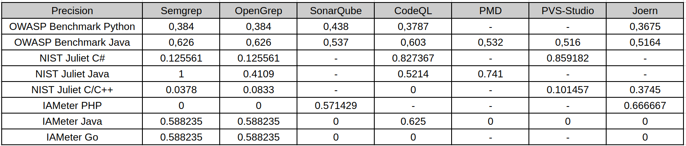

Precision shows how many reported findings were actually relevant vulnerabilities. In this study, high precision usually means that the analyzer was conservative: it reported fewer issues, but a larger share of them matched the expected vulnerability points.

This is visible in several NIST Juliet results. For example, Semgrep on Juliet Java reaches perfect precision in the local scoring, but this does not mean it is the best analyzer overall: it found only a very small subset of the actual vulnerable points. CodeQL and PVS-Studio also show relatively strong precision on NIST Juliet C# because their findings are more targeted and many out-of-scope findings are excluded by CWE-aware scoring. In contrast, OpenGrep and Semgrep on Juliet C/C++ have low precision because broad pattern-based rules produce many findings that do not match the exact expected CWE locations. OWASP Benchmark shows more balanced precision because its test cases are web-oriented and align better with common SAST rules.

Therefore, precision alone is not enough to judge tool quality. A tool may be precise because it reports only the easiest or most narrowly defined vulnerabilities.

### Recall

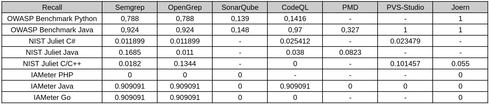

Recall is the main weak point observed across the study. It measures how many known vulnerable points were actually detected. On OWASP Benchmark and IAMeter, several tools reach high recall because the datasets are smaller or closer to common web vulnerability patterns. For example, OWASP Java and IAMeter Java/Go are much easier for rule-based tools to cover.

NIST Juliet changes the picture. Juliet contains many CWE categories, synthetic variants, legacy patterns, conditional compilation, and language-specific edge cases. Most analyzers detect only a small fraction of these cases. This is especially visible for NIST Juliet Java and C/C++, where recall is low even when precision or specificity is high. The reason is not only tool weakness: some tools do not support the required runtime well, some default rule packs do not cover the target CWE categories, and some vulnerabilities are encoded in ways that are difficult for default SAST configurations to recognize.

The practical implication is important: low recall means that a clean SAST report cannot be treated as evidence that the code is safe. It may only mean that the enabled rules did not cover the benchmark's vulnerability patterns.

### F1-Score

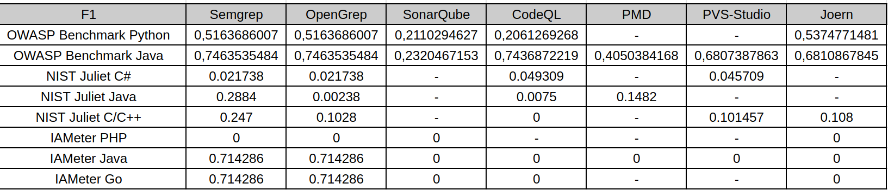

F1-score balances precision and recall, so it is the most useful single metric in this study. It penalizes both noisy tools and overly conservative tools. The F1 tables show that the best results appear mostly on OWASP Benchmark and IAMeter, where some tools achieve a reasonable balance between finding vulnerabilities and avoiding false positives.

On NIST Juliet, F1 drops sharply for most analyzers. This happens for two different reasons: some tools have acceptable precision but very low recall, while others find more issues but introduce many false positives. Both cases lead to weak F1. For example, high precision with near-zero recall still results in a low F1-score, because the analyzer misses most known vulnerabilities. Conversely, broad pattern matching may improve recall slightly, but false positives reduce precision and keep F1 low.

For this reason, F1 is the clearest summary of the trade-off observed in the research: SAST tools can be useful, but their default configurations rarely provide both broad coverage and high confidence across heterogeneous benchmarks.

### Specificity and Accuracy

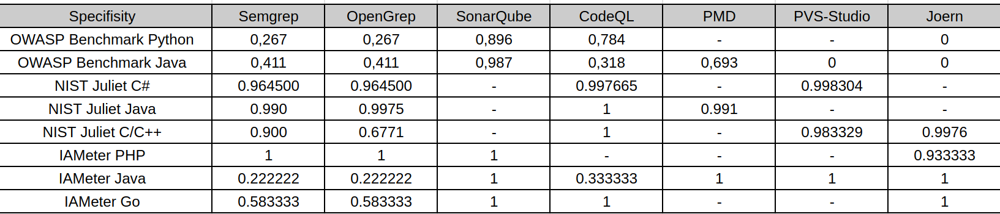

The table represents specificity: the ability to correctly ignore safe code. Specificity is often high on NIST Juliet because the number of safe or non-triggered points is large and many tools report few findings. This makes specificity useful, but potentially misleading if interpreted alone.

For example, CodeQL on Juliet C/C++ has perfect specificity because it reports no findings, but this also produces zero recall and zero F1. In that case, high specificity does not mean strong vulnerability detection; it means the tool did not raise false alarms while also missing all known vulnerabilities. Similarly, high specificity in conservative configurations should be read together with recall and F1.

Thus, specificity is most useful for estimating noise and false-positive behavior, not for measuring vulnerability coverage. A practical SAST evaluation must consider specificity together with precision, recall, and F1.

### Cross-Benchmark Observations

OWASP Benchmark produced the strongest overall results. Its web vulnerability categories are closer to the default rule sets of tools such as Semgrep, OpenGrep, CodeQL, SonarQube, PVS-Studio, and Joern. As a result, recall and F1 are generally higher there than on Juliet.

IAMeter is small and easier to inspect manually. Semgrep, OpenGrep, and CodeQL performed well on IAMeter Java/Go for the expected CWE categories, while several other analyzers found little or nothing. IAMeter PHP remained difficult for most tools in this configuration, which shows how language support and rule availability directly affect the result.

NIST Juliet is the harshest benchmark in this study. It contains a much wider set of CWE categories and many synthetic variants. It is useful for stress-testing coverage, but it also exposes limitations in default rules, language support, build requirements, and matching methodology. The poor recall on Juliet does not mean SAST tools are useless; it means default SAST configurations do not provide comprehensive CWE coverage on large synthetic suites.

Overall, none of the evaluated SAST tools demonstrated consistently high performance across all benchmarks, languages, and CWE categories. The results depend strongly on the programming language, benchmark design, enabled rule set, tool support for the target runtime, and the way findings are matched against ground truth. The same analyzer can look strong on one benchmark and weak on another, so the results should be interpreted as benchmark-specific evidence rather than as a universal ranking of tools.


### Limitations

Several limitations affect the interpretation of this research:

- The tools were not all run on every dataset. Some analyzers were excluded because they did not support the target language or runtime, such as PMD for most languages except Java, many languages does not support Java JDK8, or SonarQube CE for large suites as NIST.
- Tool configurations were not equally mature. Some tools used default rule sets, while others required custom scripts or targeted rules. This makes the comparison practical, but not perfectly symmetrical.
- NIST Juliet scoring depends heavily on matching SARIF findings to FLAW/FIX markers and CWE identifiers. Findings outside the expected CWE context can be excluded as out-of-scope, even if they point to a real issue of another type.
- Semgrep and OpenGrep results on some Juliet sections should be interpreted as line-aware marker matching rather than strict semantic vulnerability confirmation, especially where CWE-aware matching was limited.
- Some tools require successful builds or code databases. Build failures, unsupported language versions, conditional compilation, and incomplete project setup can reduce findings independently of the analyzer's theoretical capabilities.
- The study evaluates selected versions, rule packs, and scripts. Different versions, commercial rules, deeper tuning, or project-specific custom queries could change the results.

The final conclusion is that SAST tools are valuable as part of a security workflow, but they should not be treated as complete vulnerability detectors. Their output depends on rules, language support, build context, and benchmark structure. In practice, the strongest approach is to combine several analyzers, tune rules for the target language and CWE classes, and validate findings with a scoring method that separates precision, recall, specificity, and F1 rather than relying on a single metric.
